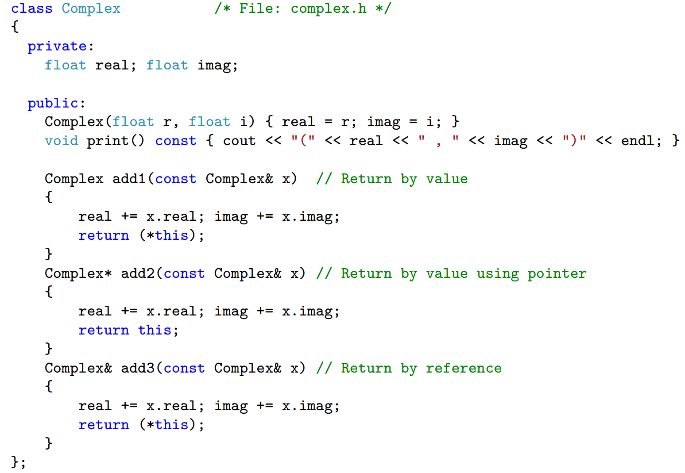
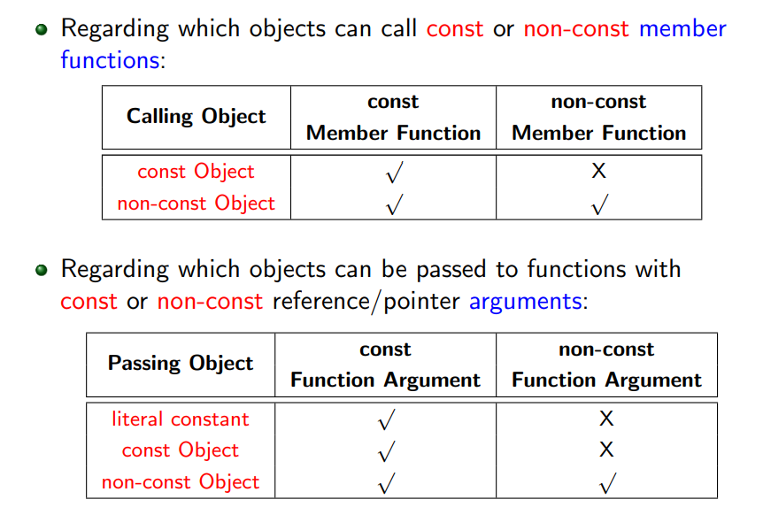

### class member function

#### inline function

For inline function, the compiler will replace the function body when the function is called by copying and pasting.

An inline function is one for which the compiler copies the code from the function definition directly into the code of the calling function rather than creating a separate set of instructions in memory. This eliminates call-linkage overhead and can expose significant optimization opportunities. 

Using the `inline` specifier is only a suggestion to the compiler that an inline expansion can be performed; the compiler is **free to ignore the suggestion**.

After compiling, the inline function will be no longer be a function when function call.

> as inline functions within the class body. The keyword inline is optional in this case.

```c++
class Person
{ ...
 Person* child() const { return _child; }
 void have_child(Person* baby) { _child = baby; }
};

class Person
{ ...
inline Person* child() const { return _child; }
inline void have_child(Person* baby) { _child = baby; }
};

```


As **inline functions**, but **outside** the class body, in the **same header file**. In this case, the keyword inline is **mandatory**. It also requires the additional prefix consisting of the class name and the class scope operator` ::` ⇒ to enhance readability especially when the class body consists of a few lines of code.

```c++
class Person
{
    inline Person* child() const;
    inline void have_child()(Person* baby) { _child = baby; }
}
inline Person* Person::child() const { return _child; }
inline void Person::have_child(Person* baby)
{ _child = baby; }

```

### Class Scope and Scope Operator ::


**C++ uses lexical (static) scope rules:** 

+ the binding of name occurrences to declarations are done statically at compile-time. 

+ Identifiers declared inside a class definition are under its scope. 

+ To define the members functions outside the class definition, prefix the identifier with the class scope operator ::

```c++
int height =10;
class Weird
{
	short height;
	Weird() { height = 5; }
    // to access the global varible height,
    // we need to use ::height
}
```

### this Pointer

+ Each class member function ==implicitly== contains a pointer of its class type named **“this”**.
+ When an object calls the function, `this` pointer is set to point to the object.

> For example, after compilation, the member function `Person::have_child(Person* baby)` of `Person` will be translated to a unique global function by adding a new argument:

```c++
void Person::have_child(Person* this, Person* baby)
{
this->_child = baby;
}
// Person* this will autonmatically add as an argument.
```

+ The call, `becky.have_child(&eddy)` becomes `Person::have_child(&becky, &eddy)`



1. return by value--> copy the content
2. return by pointer/return by reference  -->no copying
3. return by value and pointer --> **PBV**

```c++
 Complex add1(const Complex& x)  // Return by value
    {
        real += x.real; imag += x.imag;
        return (*this);
 }
```

call `add1` will create a temp object by copying the content and then return this temp object.

## Const-Ness


A `const` object should not call non-const member function, however, a non-const object can call a const member function.

To indicate that a class member function does not modify the class object — its data member(s), one can (and should!) place the const keyword after the argument list.

The this pointer in const member functions points to const objects. For example, 

+ `int Date::difference(const Date& d) const;` is compiled to            ` int Date::difference(const Date* this, const Date& d); `

  which means const member function will access the object constantly.

+ ` void Date::print() const;` is compiled to                                           `void Date::print(const Date* this);` Thus, the object calling const member function becomes const inside the function and cannot be modified.

**The syntax** for pointers to constant objects and constant pointers can be confusing.

 The rule is that:

+ `const` to the left of the $∗$ in a declaration refers to the object being pointed to.
+ `const` to the right of the $∗$ refers to the pointer itself. 
+ It can be helpful to read these declarations from right to left.

### const reference

---

```c++
void cbcr(const int& x) { x += 10; } // Error!
```

You can (and should!) express your intention to leave a reference argument of your function unchanged by making it const.

+ You may pass both **const** and **non-const** arguments to a function that requires a const reference parameter. 

+ Conversely, you may pass ==only== **non-const** arguments to a function that requires a **non-const reference parameter**



const member function can only access to other const member function

const object can only call const member function.

## Lambda

```c++
[<capture-list>]( <parameter-list> )m { <body> }
```

