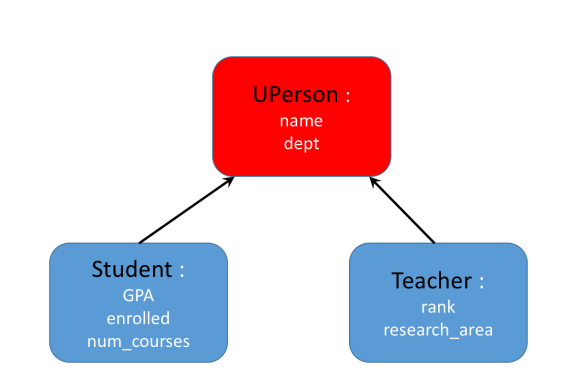
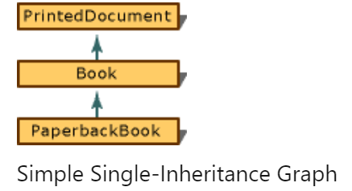
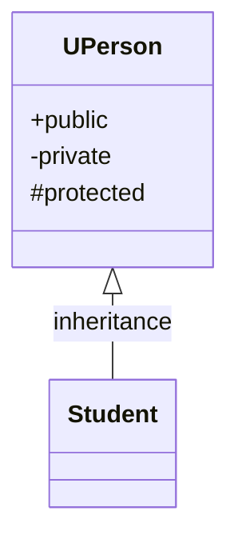
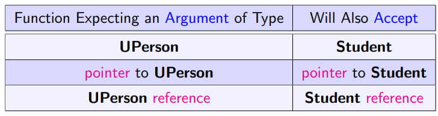
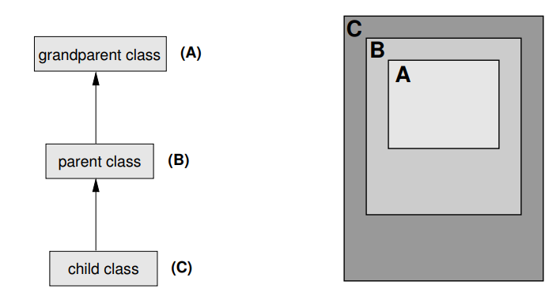

# overview

**Inheritance**-- new class can be derived from exiting class.



# Single Inheritance

## Definition

In "single inheritance," a common form of inheritance, classes have only **one base class**.



```c++
// deriv_SingleInheritance.cpp
// compile with: /LD
class PrintedDocument {};

// Book is derived from PrintedDocument.
class Book : public PrintedDocument {};

// PaperbackBook is derived from Book.
class PaperbackBook : public Book {};
```

**Notes**:

+ `Book` is a kind of a `PrintedDocument`
+ `PaperbackBook` is a kind of `Book`
+ `PrintedDocument` is considered a "direct base" class to `Book`
+ `printedDocument `it is an "indirect base" class to `PaperbackBook`

> Difference between direct base class and indirect base class
>
> + direct base class is in base list of a class declaration 
> + and an indirect base does not


 **Warning:** It is not sufficient to provide a forward-referencing declaration for a base class; it must be a complete declaration.

## Member Access Control

| type of access | meaning                                                      |
| -------------- | ------------------------------------------------------------ |
| public         | Class members declared as **`public`** can be used by any function. |
| private        | Class members declared as **`private`** can be used only by member functions and friends (classes or functions) of the class. |
| protected      | Class members declared as **`protected`** can be used by:<br /> + **member** functions and **friends** (classes or functions) of the class. <br /> + Be used by classes derived from the class.(member and friend) |


### Access Control in Derived Class





| private                                        | protected                                                    | public                                                       |
| ---------------------------------------------- | ------------------------------------------------------------ | ------------------------------------------------------------ |
| Always inaccessible with any derivation access |                                                              | **`private`** in derived class if you use **`private`** derivation |
|                                                |                                                              | **`protected`** in derived class if you use **`protected`** derivation |
|                                                | **`protected`** in derived class if you use **`public`** derivation | **`public`** in derived class if you use **`public`** derivation |

## Polymorphic or Liskov Substitution Principle

**Inheritance** implements the **is-a relationship**:

1. **Book** inherits from **PrintDocument**
   1. `Book` objects could be treated as `PrintDocument`
   
   2. All methods of `PrintDocument`can be called by a `Book` object.
   
2. A **Book** object is  a **PrintDocument** object.

an object of the **derived class** can be **treated like** an object of the **base class** *under all circumstances*.



3. base-class pointer cannot access the derived class variable

## Indirect Inheritance

+ The difference between a direct inheritance and an indirect one is that:
  + the base list of a class declaration and an indirect base does not.

```c++
#ifndef PG_STUDENT_H    /* File: pg-student.h */
#define PG_STUDENT_H

#include "student.h" 

class PG_Student : public Student
{
  private:
    string research_topic;

  public:
    PG_Student(string n, Department d, float x) :
        Student(n, d, x), research_topic("") { }

    string get_topic() const { return research_topic; }
    void set_topic(const string& x) { research_topic = x; }
};

#endif
```

## Initialization of Base Class Objects



+ Before a Student object can come into existence, we have to create its `UPerson` parent first.
+  Student’s constructors have to call a `UPerson’s` constructor through the member initializer list.

Every derived class have the responsibility to use the constructor of its direct base class to create it before itself created.

### Order of Construction/Destruction:

**The order is construction of a class object**

0. Parents' member

1. its parent 
2. its data members (in the order of their appearance in the class definition) 
3. itself

**The order is destruction of a class object**

1. itself
2. its data members (in the order of their appearance in the class definition) 
3. its parent 

### Problems in Inheritance:

1. **Slicing**:

```c++
#include <iostream>     /* File: slice.cpp */
#include <string>
using namespace std;
#include "../basics/uperson.h"
#include "../basics/student.h"

int main()
{
    Student student("Snoopy", CSE, 3.5);
    UPerson* pp = &student;
    UPerson* pp2 = new Student("Mickey", ECE, 3.4);

    UPerson uperson("Unknown", CIVL); 
    uperson = student; // What does "uperson" have?
    return 0;
}
```

`UPerson` here will only have part of the object `student`, which is the inherited part.

2. **name conflict**


#### summary:

+ Behavior and structure of the base class is inherited by the derived class. 

+ However, constructors and destructor are an exception. They are never inherited.

+  There is a kind of contract between a base class and a derived class: 

  + The base class provides functionality and structure (methods and data members).

  + The derived class guarantees that the base class is initialized in a consistent state by calling an appropriate constructor. 

    A base class is constructed before the derived class. 

    A base class is destructed after the derived class.


## Dynamic Binding & Virtual

### Static Binding

**In polymorphic substitution principle**, 

a function accepting 1. a **base class** **object** 

​									  2. its **derived objects**.

The binding (association) of a function name to appropriate method is done by static analysis of the code at compile time based on the static(declared) type of object.

+ By default, C++ uses **static binding**. (Same as C, Pascal, and FORTRAN.)
+ In static binding, what a pointer really points to, or what a reference actually refers to **is not considered**; only the pointer/reference **type** is.

```c++
#include <iostream>     /* File: print-label.cpp */
using namespace std;
#include "student.h"
#include "teacher.h"

void print_label_v(UPerson uperson) { uperson.print(); }
void print_label_r(const UPerson& uperson) { uperson.print(); }
void print_label_p(const UPerson* uperson) { uperson->print(); }

int main() {
    UPerson uperson("Charlie Brown", CBME);
    Student student("Edison", ECE, 3.5);
    Teacher teacher("Alan Turing", CSE, PROFESSOR, "CS Theory");
    student.add_course("COMP2012"); student.add_course("MATH1003");

    cout << "\n##### PASS BY VALUE  #####\n";
    print_label_v(uperson); print_label_v(student); print_label_v(teacher);

    cout << "\n##### PASS BY REFERENCE  #####\n"; 
    print_label_r(uperson); print_label_r(student); print_label_r(teacher);

    cout << "\n##### PASS BY POINTER  #####\n"; 
    print_label_p(&uperson); print_label_p(&student); print_label_p(&teacher);
}

```

It is ok to put both **base class** and **derived class** as the arguments:

`void print_label_v(UPerson uperson) { uperson.print(); }`

However, only the `UPerson` part will be bond in this function (even the object of `teacher` , only the inherited `UPerson ` part will be linked).

**`static_cast`**:

```c++
#include <iostream> /* File: static-example.cpp */
using namespace std;
#include "teacher.h"

int main()
{
    UPerson uperson("Charlie Brown", CBME);
    Teacher teacher("Alan Turing", CSE, PROFESSOR, "CS Theory");
    UPerson *u;
    Teacher *t;
    /*cout << "\nUPerson object pointed by Teacher pointer:\n";
    t = &uperson; t->print(); // Error: convert base-class ptr*/
    //        to derived-class ptr
    cout << "cast____static";
    t = static_cast<Teacher *>(&uperson);
    t->print(); // Ok, but ...
}
```

> If you static_cast a derived class to a base class pointer, it's ok to compile but   **its output is non-sense.**

dynamic_cast()

when dynamic_cast fails, it will return null pointer for you.

### dynamic Binding

+ When dynamic binding is used, the actual method to be called is selected using the actual type of the object in the call, but only if the object is **passed by reference or pointer**.
  + reference can be considered as an alias
  + pointer is obvirous.

### Virtual Functions

+ A virtual function is declared using the keyword `virtual` in the **class definition**, and **not** in the method **implementation**, if it is defined outside the class. 

+ Once a method is declared `virtual` in the base class, it is automatically virtual in **all directly or indirectly derived classes**.

+ Even though it is not necessary to use the virtual keyword in the derived classes, it is **a good style** to do so because it improves the **readability** of header files.

+ Calls to virtual functions are a little bit **slower than normal** function calls. The difference is extremely small and it is not worth worrying about, unless you write very speed-critical code.

==Note:==

+ Functions in derived classes override virtual functions in base classes only if their **type is the same**.
+ A call to a virtual function is resolved according to the underlying type of object for which it is called.
+ A call to a nonvirtual function is resolved according to the type of the pointer or reference.

```c++
// deriv_VirtualFunctions2.cpp
// compile with: /EHsc
#include <iostream>
using namespace std;

class Base {
public:
   virtual void NameOf();   // Virtual function.
   void InvokingClass();   // Nonvirtual function.
};

// Implement the two functions.
void Base::NameOf() {
   cout << "Base::NameOf\n";
}

void Base::InvokingClass() {
   cout << "Invoked by Base\n";
}

class Derived : public Base {
public:
   void NameOf();   // Virtual function.
   void InvokingClass();   // Nonvirtual function.
};

// Implement the two functions.
void Derived::NameOf() {
   cout << "Derived::NameOf\n";
}

void Derived::InvokingClass() {
   cout << "Invoked by Derived\n";
}

int main() {
   // Declare an object of type Derived.
   Derived aDerived;

   // Declare two pointers, one of type Derived * and the other
   //  of type Base *, and initialize them to point to aDerived.
   Derived *pDerived = &aDerived;
   Base    *pBase    = &aDerived;

   // Call the functions.
   pBase->NameOf();           // Call virtual function.
   pBase->InvokingClass();    // Call nonvirtual function.
   pDerived->NameOf();        // Call virtual function.
   pDerived->InvokingClass(); // Call nonvirtual function.
}
/*
output:
Derived::NameOf
Invoked by Base
Derived::NameOf
Invoked by Derived
*/
```

Note that:

+ **Virtual function is always called form derived**. Regardless of whether the `NameOf` function is invoked through a pointer to `Base` or a pointer to `Derived`, it calls the function for `Derived`. 
+ **None virtual function called from the type-of pointer objects**. It calls the function for `Derived` because `NameOf` is a virtual function, and both `pBase` and `pDerived` point to an object of type `Derived`.

###  override

The override function is binding at run time, so it will ignore the member access control, for after compiling, every function is global.

Which means: if there is a function ` virtual print()` at base class and this function is override by the derived class private `print()`. Its ok to compile and ok to override!

```c++
#include <iostream> /* File: override.cpp */
using namespace std;

class Base
{
public:
  virtual void f(int a) const { cout << a << endl; }
};

class Derived : public Base
{
  int x{25};

private:
  void f(int) const override;
};

// Don't repeat the keyword override here
void Derived::f(int b) const { cout << x + b << endl; }

int main()
{
  Derived d;
  Base &b = d;
  b.f(5);        //though f() is overridev by private, it could be called as well
  return 0;
}
```

```
output: 
30
```


