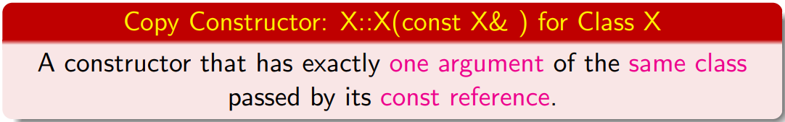

# Constructor


## What is a constructor

+ **Same name** - Syntactically, a class constructor is a special member function having the same name as the class.
+ **No return**     - A constructor **must not** specify a return type or explicitly returns a value — not even the void type.
+ A **constructor** is called ==whenever== an object is created:
  + on object creation 
  + when object **passed** to  a function by ==**value**==
  + when object **returned** from a function by ==**value**==

> 1. Typically, constructors have **public** accessibility so that code outside the class definition or inheritance hierarchy can create objects of the class.
> 2. But you can also declare a constructor as **`protected`** or **`private`**.

##  Default Initializers for Non-static Data Members

C++11 allows **default** values for **non-static** data members of a class.

for example:

```C++
class Word
{
    int frequency{0};
    cosnt char* str{nullptr};
};
```

C++ supports a more general mechanism for **user-defined initialization** of class objects through constructor member functions.

During the construction of a non-global object, if its **constructor** does not initialize a **non-static member**, it will have the value of its default initializer if it exists, otherwise its value is **undefined**. ::UB(undefined behavior)

```c++
class Box {
public:
    // Default constructor
    Box() {}

    // Initialize a Box with equal dimensions (i.e. a cube)
    explicit Box(int i) : m_width(i), m_length(i), m_height(i) // member init list
    {}

    // Initialize a Box with custom dimensions
    Box(int width, int length, int height)
        : m_width(width), m_length(length), m_height(height)
    {}

    int Volume() { return m_width * m_length * m_height; }

private:
    // Will have value of 0 when default constructor is called.
    // If we didn't zero-init here, default constructor would
    // leave them uninitialized with garbage values.
    int m_width{ 0 };
    int m_length{ 0 };
    int m_height{ 0 };
};
```

+ You can define as many overloaded constructors as needed to customize initialization in various ways.

### some tips:

When you declare an instance of a class, the compiler chooses which constructor to invoke based on the rules of overload resolution:

```c++
int main()
{
    Box b; // Calls Box()

    // Using uniform initialization (preferred):
    Box b2 {5}; // Calls Box(int)
    Box b3 {5, 8, 12}; // Calls Box(int, int, int)

    // Using function-style notation:
    Box b4(2, 4, 6); // Calls Box(int, int, int)
}
```

- Constructors may be declared as **`inline`**, [`explicit`](https://learn.microsoft.com/en-us/cpp/cpp/constructors-cpp?view=msvc-170#explicit_constructors), [`friend`](https://learn.microsoft.com/en-us/cpp/cpp/friend-cpp?view=msvc-170), or [`constexpr`](https://learn.microsoft.com/en-us/cpp/cpp/constructors-cpp?view=msvc-170#constexpr_constructors).
- A constructor can initialize an object that has been declared as **`const`**, **`volatile`** or **`const volatile`**. The object becomes **`const`** after the constructor completes.
- To define a constructor in an implementation file, give it a qualified name like any other member function: `Box::Box(){...}`.

## Default constructor

If not defined, the compiler will automatically generate 3 free constructors:

+ default constructor
+ default copy constructor
+ default move constructor


+ If there are no user-defined constructors in the definition of class X, the compiler will generate the following default constructor for it.

  `X::X() { }`

+ The default constructor only creates an object with **enough space** for its components.

+ The initial values of the data members **cannot be trusted**.

+ Only **no user-defined constructors**  --> compiler automatically generate  an implicit **`inline`** default constructor `X::X(){ }`.


1. *Default constructors* typically have no parameters, but they can have parameters with default values.

```c++
class Box {
public:
    Box() { /*perform any required default initialization steps*/}

    // All params have default values
    Box (int w = 1, int l = 1, int h = 1): m_width(w), m_height(h), m_length(l){}
    // also called a default constructor 
...
}
```

2. You can prevent the compiler from generating an implicit default constructor by defining it as [deleted](https://learn.microsoft.com/en-us/cpp/cpp/constructors-cpp?view=msvc-170#explicitly_defaulted_and_deleted_constructors):

```c++
    // Default constructor
    Box() = delete;
```

3. If any non-default constructors are declared, the compiler doesn't provide a default constructor:

```c++
class Box {
public:
    Box(int width, int length, int height)
        : m_width(width), m_length(length), m_height(height){}
private:
    int m_width;
    int m_length;
    int m_height;

};

int main(){

    Box box1(1, 2, 3);
    Box box2{ 2, 3, 4 };
    Box box3; 
    // C2512: no appropriate default constructor available
}
```

4. If a class has no default constructor, an array of objects of that class can't be constructed by using square-bracket syntax alone. 

   For example, given the previous code block, an array of Boxes can't be declared like this:

```c++
Box boxes[3]; // C2512: no appropriate default constructor available
```

However, you can use a set of initializer lists to initialize an array of Box objects:

```c++
Box boxes[3]{ { 1, 2, 3 }, { 4, 5, 6 }, { 7, 8, 9 } };
```

## Implicit Conversion Constructor(s)


**Conversion Constructor**: A constructor accepting a single argument specifies a conversion from its argument type to the type of its class:

+ Word(const char*): const char* −→ Word 
+ Word(char): char −→ Word

```c++
1 #include <cstring> /* File: implicit-conversion-constructor.cpp */
2 class Word
3 {
4 private: int frequency; char* str;
5 public:
6 Word(char c)
7 { frequency = 1; str = new char[2]; str[0] = c; str[1] = ’\0’; }
8 Word(const char* s) // Assumption: s != nullptr
9 { frequency = 1; str = new char [strlen(s)+1]; strcpy(str, s); }
10 };
11
12 int main()
13 {
14 Word movie("Titanic"); // Explicit conversion
15 Word movie2 {’A’}; // Explicit conversion
16 Word movie3 = ’B’; // Implicit conversion
17 Word director = "James Cameron"; // Implicit conversion
18 }
```

+ A class may have more than one conversion constructor. A constructor may have multiple arguments; 
+ if all but one argument have default values, it is still a conversion constructor.

```c++
Word(const char* s, int k = 1) 
// Still conversion constructor!
{
frequency = k;
str = new char [strlen(s)+1]; strcpy(str, s);
}
```

**`explicit` keyword**

To disallow perhaps unexpected implicit conversion (c.f. coercion among basic types), add the keyword ’`explicit`’ before a **conversion constructor**.

```c++
#include <cstring> /* File: explicit-conversion-constructor.cpp */
class Word
{
private:
int frequency; char* str;
public:
explicit Word(const char* s)
{ frequency = 1; str = new char [strlen(s)+1]; strcpy(str,s); }
};

int main()
{
Word *p = new Word("action"); // Explicit conversion
Word movie("Titanic"); // Explicit conversion
Word director = "James Cameron"; // Bug: implicit conversion
}
```

## Copy Constructor

### definition

+ A ***copy constructor*** initializes an object by **copying** the member values from an object of the **same type**.

+ compiler-generated copy constructor

  If your class members are all simple types such as scalar values, the compiler-generated copy constructor is sufficient and you don't need to define your own.

+ If your class requires more complex initialization, then you need to implement a custom copy constructor.

> If a class member is a **pointer** then you need to define a **copy constructor** to **allocate new memory** and copy the values from the other's pointed-to object. 
>
> The compiler-generated copy constructor simply **copies the pointer**, so that the new pointer still points to the other's memory location.



### When to call

It is called upon when:

+ parameter **passed** to a function **by value**. 
+ **initialization** using the **assignment syntax** though it actually is not an assignment: 
  + Word x {"Star Wars"}; Word y = x; 
+ object **returned** by a function **by value**.

### Form of Copy Constructor

```c++
    Box(Box& other); // Avoid if possible--allows modification of other.
    Box(const Box& other);
    Box(volatile Box& other);
    Box(volatile const Box& other);

    // Additional parameters OK if they have default values
    Box(Box& other, int i = 42, string label = "Box");
```

You can prevent your object from being copied by defining the copy constructor as deleted:

```c++
 Box (const Box& other) = delete;
```

#### Notice:

```c++
int main()
 {
 Word movie("Titanic"); // conversion
 Word song(movie); 		// copy
 Word ship = movie;		// copy constructor
 /* the equal is not an assignment, "=" will be replaced by Word ship{ movie };
 */
 Word actress {"Kate"}; // conversion constructor
 }

```

### Return-by-Value ⇒ Copy Constructor

Look at this code block carefully:

```c++
class Word
{
private:
	int frequency; char* str;
	void set(int f, const char* s)
	{ 
        frequency = f; str = new char [strlen(s)+1]; 
        strcpy(str, s); 
    }
public:
	Word(const char* s, int k = 1)
    { set(k, s); cout << "conversion\n"; }
	Word(const Word& w)
    { set(w.frequency, w.str); cout << "copy\n"; }
	void print() const
    { cout << str << " : " << frequency << endl; }
    
/*-----------------------------*/    
	Word to_upper_case() const
	{
		Word x(*this); //1. copy a new word object x
        for (char* p = x.str; *p != ’\0’; p++) 
            *p += ’A’- ’a’;
        return x;     //2.return --> copy to a temp place
    }
/*-----------------------------*/    
};
int main()
{
	Word movie {"titanic"}; movie.print();
	Word song = movie.to_upper_case(); song.print();
    
   //3. x is copy to  song by a copy constructor
}

```

RVO:  // return value optmization

IN above code, It should be 3 copy, however, there is only one copy occur in practice. That's because the compiler perform RVO here.

###  Copy Elision and Return Value Optimization

to be accomplished

### Default Copy Constructor

If no copy constructor is defined for a class, the compiler will automatically supply it a **default** copy constructor

+ the constructor in form of`X(const X&){ /*memberwise copy*/ }`
+ ⇒ **memberwise copy** (aka copy assignment) by calling the copy constructor of each data member:
  + copy ` movie.frequency `to `song.frequency` 
  + copy `movie.str` to `song.str`
+ even for **array members** by copying each array element

### Default MemberWise Assignment

Objects of basic data types support many operator functions such as$ +$, $−$,$ ×$, $/$.

**operator overloading**: C++ allows user-defined types to overload most (not all) operators to re-define the behavior for their objects.

+ Unless you re-define the assignment operator ’=’ for a class, the compiler generates the default assignment operator function — memberwise assignment — for it

### Member Initializer List(MIL)

It is actually **preferred** to initialize them **before** the constructors’ **function body** through the member initializer list by calling their **own constructors**.

+ initialize before function body
+ calling their own constructor 
+ order of the members in the list doesn’t matter

 #### What must be initialized in the member initializer list?

> 1. **For initialization of non-static `const` data members**
> 2. members with reference type
> 3. **member objects which do not have default constructor**
> 4. **base class members** 
> 5. constructor’s parameter name is same as data member
> 6. **For Performance reasons:**

##### initialization of non-static `const` data members:

```c++
#include<iostream>
using namespace std;
class Test {
    const int t;
public:
    Test(int t):t(t) {}  //Initializer list must be used
    int getT() { return t; }
};
 
int main() {
    Test t1(10);
    cout<<t1.getT();
    return 0;
}
 
/* OUTPUT:
   10
*/
```

+ No memory is allocated separately for const data member, it is folded in the symbol table due to which we need to initialize it in the initializer list. 
+ It is a Parameterized constructor and we don’t need to call the assignment operator which means we are avoiding one extra operation. 

##### For initialization of reference members:

```c++
// Initialization of reference data members
#include<iostream>
using namespace std;
 
class Test {
    int &t;
public:
    Test(int &t):t(t) {}  //Initializer list must be used
    int getT() { return t; }
};
 
int main() {
    int x = 20;
    Test t1(x);
    cout<<t1.getT()<<endl;
    x = 30;
    cout<<t1.getT()<<endl;
    return 0;
}
/* OUTPUT:
    20
    30
 */
```

+ before the `test` object is construct, the member `t`, which is an alias, must be bound to other int object.


###### For initialization of **member objects which do not have default constructor**:

```c++

#include <iostream>
using namespace std;
 
class A {
    int i;
public:
    A(int );
};
 
A::A(int arg) {
    i = arg;
    cout << "A's Constructor called: Value of i: " << i << endl;
}
 
// Class B contains object of A
class B {
    A a;
public:
    B(int );
};
 
B::B(int x):a(x) {  //Initializer list must be used
    cout << "B's Constructor called";
}
 
int main() {
    B obj(10);
    return 0;
}
/* OUTPUT:
    A's Constructor called: Value of i: 10
    B's Constructor called
*/
```

If class A had **both default and parameterized constructors**, then Initializer List is not must if we want to initialize “a” using default constructor, but it is must to initialize “a” using parameterized constructor. 

##### **For initialization of base class members :**

For example, a father class named `Dad` and a offspring named `Son`

```c++
class Dad
{
    private: 
    int age;
    public:
    Dad( int);  
};
Dad::Dad(int arg) {
    i = arg;
    cout << "Dad's Constructor called: Value of i: " << i << endl;
}
class Son: Dad
{
    private: 
    int age;
    public:
    Son( int);  
};
Son::Son(int x):Dad(x) { //Initializer list must be used
    cout << "Son's Constructor called";
};
 
```

**When constructor’s parameter name is same as data member:**

```c++
#include <iostream>
using namespace std;
 
class A {
    int i;
public:
    A(int );
    int getI() const { return i; }
};
 
A::A(int i):i(i) { }  // Either Initializer list or this pointer must be used


/* The above constructor can also be written as
A::A(int i) {
    this->i = i;
}
*/
```


## Order of Construction

1. Virtual base classes are initialized, in the order they appear in the base list.

2. Nonvirtual base classes are initialized, in declaration order.

3. Class members are initialized in declaration order (regardless of their order in the initialization list).

4. The body of the constructor is executed.

   
