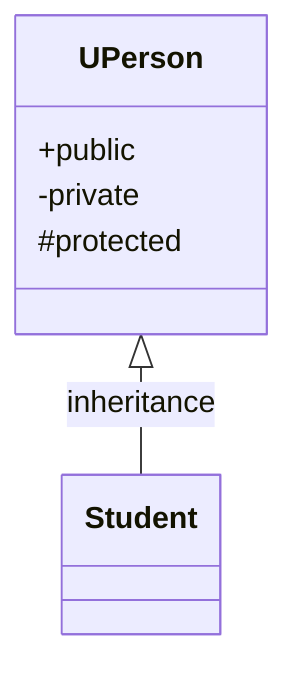
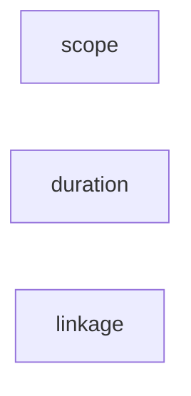
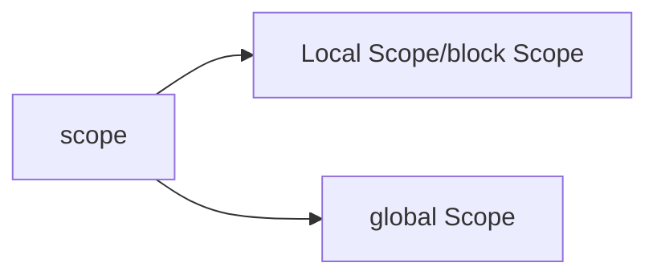
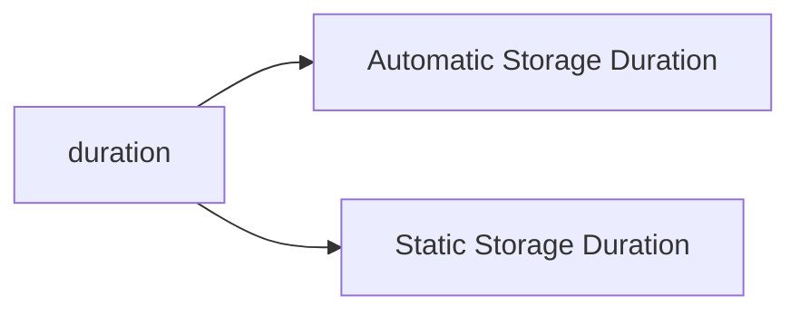
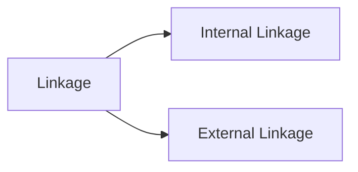

# "Object-oriented"


-----------

**First Idea**
```c++
struct Student 
{ 
	std::string name; 
	std::string suid; 
	int unitsTaken; 
};
```
==A Struct==

------
==What are the issues with using just structs?== 
● Public access to all internal state data. 

● Users of struct need to explicitly initialize each data member. 

● In short: not one neat package of an object

------
“**A struct** simply feels like an open pile of bits with very little in the way of encapsulation or functionality. 

**A class** feels like a living and responsible member of society with intelligent services, a strong encapsulation barrier, and a well defined interface”

------
**Second Idea**

```c++
class Student
{
public:
	Student(std::string name_, 
	std::string suid_);
	~Student();
	addCredit();
private:
	std::string name; 
	std::string suid; 
	int unitsTaken; 
};
```
==A class==

-------
# 欢迎来到OP的世界
![[Pasted image 20230112202659.png]]

--------
# **Concepts** & *Terminologies*
![[Pasted image 20230112202911.png]]

----------------
## What is an object?
"[objects](https://en.wikipedia.org/wiki/Object_(computer_science) "Object (computer science)")", which can contain [data](https://en.wikipedia.org/wiki/Data "Data") and [code](https://en.wikipedia.org/wiki/Computer_program "Computer program").
+  an identifiable entity
+ characteristics and behaviour

+  When a class is ==defined==, no memory is ==allocated== 
+ but when it is ==instantiated==, memory is ==allocated==.
 
-------------------
## What is a class?
### **definitions** for : 
+ data format (data)
+ methods      (code)

### contains of: 
+ the data members
+ member functions

----
**A student?** 
● They have a name (string) 
● They have a SUID (string)
● They have taken a certain number of units (int)

==How to represent a student in code?==
```c++
class Student
{
public:
	Student(std::string name_, 
	std::string suid_);   //constructor
	~Student();           //destructor
	addCredit();          //method  (member function)
private:
	std::string name;     //data members
	std::string suid;     //
	int unitsTaken; 
};
```
---------------
##### Static Member functions in C++

A function is made static by using `static` keyword with function name. These functions work for the class as whole rather than for a particular object of a class.

```c++

class X
{
    public:
    static void f()
    {
        // statement
    }
};

int main()
{
    X::f();   // calling member function directly with class name
}
```
--------------
#### Object

An Object is an identifiable entity with some characteristics and behaviour. An Object is an instance of a Class. When a class is defined, no memory is allocated but when it is instantiated (i.e. an object is created) memory is allocated.


```
Student ustStudent();
```

Each object contains data and code to manipulate the data. Objects can interact without having to know details of each other’s data or code.

------
#### Encapsulation

Encapsulation is defined as wrapping up of data and information under a single unit.

In Object-Oriented Programming, Encapsulation is defined as binding together the data and the functions that manipulate them.

Encapsulation also leads to _data abstraction or hiding_.

---

#### [](https://gist.github.com/krishnadey30/cb64bf875f29b5a6c91f79ea38a2ba4e#abstraction)Abstraction

Abstraction means displaying only essential information and hiding the details.

Data abstraction refers to providing only essential information about the data to the outside world, hiding the background details or implementation.

-   _Abstraction using Classes_
-   _Abstraction in Header files_
--------------
#### Inheritance

The capability of a class to derive properties and characteristics from another class is called Inheritance.

-   **Sub Class**: The class that inherits properties from another class is called Sub class or Derived Class.
-   **Super Class**: The class whose properties are inherited by sub class is called Base Class or Super class.

-   **Re-usability**: Inheritance supports the concept of “re-usability”
------------------
#### Inheritance
```c++
class UPerson

{
  private:
    string name;
    Department dept;
  protected:
    void set_name(string n) { name = n; }
    void set_department(Department d) { dept = d; }
    
  public:
    UPerson(string n, Department d) : name(n), dept(d) { }
    string get_name() const { return name; }
    Department get_department() const { return dept; }

};
```

-------------
#### Public Inhertiance
```c++
class Student : public UPerson // ??? = public/protected/private

{
  private:
    float GPA;
    Course* enrolled;
    int num_courses;
  public:
    Student(string n, Department d, float x) :
        UPerson(n, d), GPA(x), enrolled(nullptr), num_courses(0) { }

    float get_GPA() const { return GPA; }
    bool enroll_course(const string& c) { /* incomplete */ };
    bool drop_course(const Course& c) { /* incomplete */ };
};
```

--------
| type of access | meaning                                                      |
| -------------- | ------------------------------------------------------------ |
| public         | Class members declared as **`public`** can be used by any function. |
| private        | Class members declared as **`private`** can be used only by member functions and friends (classes or functions) of the class. |
| protected      | Class members declared as **`protected`** can be used by:<br /> + **member** functions and **friends** (classes or functions) of the class. <br /> + Be used by classes derived from the class.(member and friend) |

-----------------------



----------------


| private                                        | protected                                                    | public                                                       |
| ---------------------------------------------- | ------------------------------------------------------------ | ------------------------------------------------------------ |
| Always inaccessible with any derivation access |          protected                                              | **`private`** in derived class if you use **`private`** derivation |
|                    hidden                   |          protected                                         | **`protected`** in derived class if you use **`protected`** derivation |
|                     hidden                      | hidden              | **`public`** in derived class if you use **`public`** derivation |

-------------
#### Single Inheritance:
![[Pasted image 20230112231237.png]]

```c++
class UPerson{};
class Student :public UPerson
{};
```
------


#### Multiple Inheritance:
![[Pasted image 20230112231203.png]]

```c++
class Rectangle{};
class Rhombus{};
class Square: public Rectangle,Rhombus
{}
```
--------------
#### Hierarchical Inheritance:
![[Pasted image 20230112231534.png]]
```c++
class UPerson{};
class Student :public UPerson
{};
class teacher :public UPerson
{};
```
---------
#### Multilevel Inheritance:
![[Pasted image 20230112231857.png]]
```c++
class UPerson{};
class Student :public UPerson
{};
class CSEStudent: public Student
{};
```
-------------
#### Static 


**(A). variables**

**(B). functions**

**(C). member variables/functions of classes**

--------------
#### **(A) 'static' keyword for variables**



------
**Scope** : Determines where in the file, the variable is accessible.

----------------

**Duration** : Determines when a variable is created and destroyed.


---------------------------

**Linkage**: Determines whether a variable can be accessed (or linked ) in another file.


-------------
(i) **Automatic Storage Duration**: 
for variables having Local or Block scope.
(ii) **Static Storage Duration**:
for variables having Global Scope or local variables (in a function or a in a code block) with _static_ specifier.

-----------------
 (i) **Internal Linkage**: 
 for variables having Block Scope and Global Scope/File Scope/Global Namespace scope
 (ii)**External Linkage**: 
 for variables having only for Global Scope/File Scope/Global Namespace Scope
 -----
Global and local
```c++
#include <iostream>
int global_var1;          //has global scope
const global_var2(1.618); //has global scope

int main()
{
//these variables are local to the block main.
//they have automatic duration, i.e, they are created when the main() is 
//  executed and destroyed, when main goes out of scope
 int local_var1(23);
 const double local_var2(3.14);
 }
```

-------------
#### **1. Static Keyword for global variables**

```c++
static int globalVariable = 10;
```
**Internal Linkage**
Cannot be access in another file.

```cpp
extern double global_var4 = 71;
```
**External Linkage**
can be access in another file.

-----------
(i) **If a global variable is non-const, its linkage is extern by default**
(ii) **If a global variable is const, its linkage is static by default**
```cpp
int globalVar1; 
//  uninitialized global variable with external linkage 
static int globalVar2;
// uninitialized global variable with internal linkage
const int globalVar3; 
// error, since const variables must be initialized upon declaration
const int globalVar4 = 23;
//correct, but with static linkage (cannot be accessed outside the file where it has been declared*/
extern const double globalVar5 = 1.57;
//this const variable ca be accessed outside the file where it has been declared
```
------------------
In another file
```cpp
//using_globalVariables1.cpp (eg for the usage of global variables above)
// Forward declaration via extern keyword:
 extern int globalVar1; // correct since globalVar1 is not a const or static
 extern int globalVar2; //incorrect since globalVar2 has internal linkage
 extern const int globalVar4; /* incorrect since globalVar4 has no extern specifier, limited to internal linkage by default */
 
extern const double globalVar5; /*correct since in the previous file, it has extern specifier, no need to initialize the const variable here, since it has already been egitimately defined perviously */
```
----------------
#### **2. Static Keyword for local variables**

**(i) static keyword for variables within a function block.**

No static: automatic storage duration
Satatic:     static storage duration
```cpp  
 int localVariable()
{
  int tempID = 1;  //tempID created here
  return (tempID++); //copy of tempID returned and tempID incremented to 2
} //tempID destroyed here, hence value of tempID lost
int staticLocalVariable()
{
  static int newID = 1;//newID has static duration, with internal linkage
  return newID++; 
}  //newID doesn't get destroyed here :-)
```
--------

```c++
int main()
{
  int ID1 = localVariable();  //ID1 = 1
  int ID2 = localVariable();  //ID2 = 1 again (not desired)
  int staticID1 = staticLocalVariable(); //employeeID3 = 0;
  int staticID2 = staticLocalVariable(); //employeeID4 = 1;
  int staticID3 = staticLocalVariable(); //employeeID5 = 2;
  return 0;
}
```
-------
#### **(B) 'static' keyword used for functions**

the static keyword has a straightforward meaning. Here, it **refers to linkage of the function**

**using a static keyword before the function declaration limits its linkage to internal**

-------------
#### **(C) Staitc Keyword used for member variables and functions of classes**
1. Normal members are associated with class objects
2. **Static members are not associated with class objects**

----

```cpp
#include <iostream>

class Something
{
public:
    int m_value{ 1 };
};

int main()
{
    Something first;
    Something second;

    first.m_value = 2;

    std::cout << first.m_value << '\n';    //  2
    std::cout << second.m_value << '\n';   //  1

    return 0;
}
```

-----
```cpp
#include <iostream>

class Something
{
public:
    static int s_value;
    int a_value;
    static int memFunc();
    int mumFunc1();
};

int Something::s_value{ 1 };
Somthing::memFunc()
{
	s_value++;
}
Something::memFunc1()
{
	a_value++;
}
int main()
{
    Something first; //1
    first.memFunc1(); //2
   //3
    Something second; //1
    second.memFunc1(); //2 

    first.s_value = 2;

    std::cout << first.s_value << '\n';      // 2
    std::cout << second.s_value << '\n';     // 2
    return 0;
}
```

------
**2. 'static' keyword for member function of classes**

 Normal member functions of classes are always associated with a object of the class type. 
 
 In contrast, static member functions of a class are not associated with any object of the class,
 
  i.e they have no *this pointer.
  --------------
static member functionshave no `*this` pointer
they can be called using the class name and scope resolution operator 
in the main function 
```c++
ClassName::functionName();
```
-----------
Thirdly static member functions of a class can only access static member variables of a class, 
since **non-static member variables of a class must belong to a class object**.

-----------
